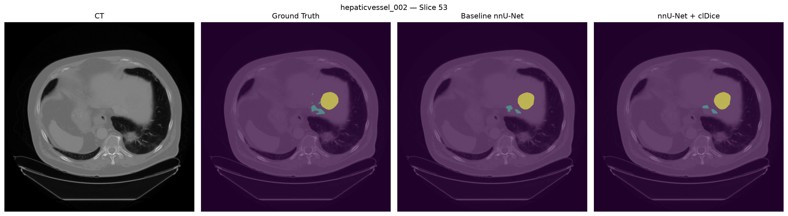

# Hepatic Vessel and Tumor Segmentation with 3D nnU-Net

This project investigates automatic segmentation of hepatic vessels and tumors from abdominal CT using the **Medical Segmentation Decathlon (MSD) Task08 Hepatic Vessel** dataset.

A baseline 3D nnU-Net was trained and evaluated on an independent holdout set. The baseline was then extended with a **vessel-specific topology-aware clDice loss** to test whether encouraging vessel connectivity could improve segmentation performance.

## Dataset

The dataset contains **303 labeled CT volumes** with:

- `0` — Background
- `1` — Hepatic Vessel
- `2` — Tumor

A reproducible split with seed 42 was used:

| Split | Cases |
|---|---:|
| Development set | 242 |
| External holdout set | 61 |

Within the development set, nnU-Net fold 0 used **193 training** and **49 validation** cases.

## Baseline Model

The baseline used nnU-Net v2 with the `3d_fullres` configuration.

- Architecture: 3D PlainConvUNet
- Patch size: `64 x 192 x 192`
- Batch size: 2
- Epochs: 1000
- Loss: Dice + Cross Entropy
- Input: CT
- Fold: 0

Training was performed on an NVIDIA RTX 2080 Ti GPU.

## clDice Experiment

The baseline was extended with a vessel-specific topology-aware loss:

`Total Loss = Dice + Cross Entropy + 0.3 x clDice`

The clDice term was applied specifically to the hepatic vessel class.

Because full-resolution 3D clDice exceeded available GPU memory, the topology term was computed at half spatial resolution while Dice and Cross-Entropy remained at full resolution.

All other training settings were kept identical to the baseline.

## Results

Both models were evaluated on the same **61-case external holdout set**.

| Metric | Baseline nnU-Net | nnU-Net + clDice |
|---|---:|---:|
| Vessel Dice | 0.6351 | **0.6373** |
| Tumor Dice | 0.6678 | **0.6698** |
| Mean Foreground Dice | 0.6514 | **0.6536** |

The topology-aware loss produced a modest improvement in holdout performance.

## Qualitative Results



Additional comparison figures are available in `results/figures/`.

## Repository Structure

```text
hepatic-vessel-tumor-segmentation/
├── custom_trainers/
├── scripts/
├── slurm/
├── results/
│   ├── figures/
│   └── metrics/
├── .gitignore
└── README.md
'''

## Implementation

The project uses:

- Python
- PyTorch
- nnU-Net v2
- NumPy
- NiBabel
- Matplotlib
- CUDA
- SLURM

Raw CT volumes, labels, preprocessing outputs, trained checkpoints, prediction NIfTI files, environments, and SLURM logs are intentionally excluded from this repository.

## References

- Isensee F, Jaeger PF, Kohl SAA, Petersen J, Maier-Hein KH. *nnU-Net: a self-configuring method for deep learning-based biomedical image segmentation.* Nature Methods. 2021.
- Shit S, Paetzold JC, Sekuboyina A, et al. *clDice — a novel topology-preserving loss function for tubular structure segmentation.* CVPR. 2021.
- Medical Segmentation Decathlon — Task08 Hepatic Vessel.
